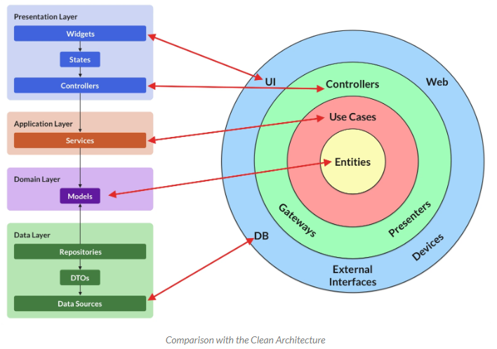
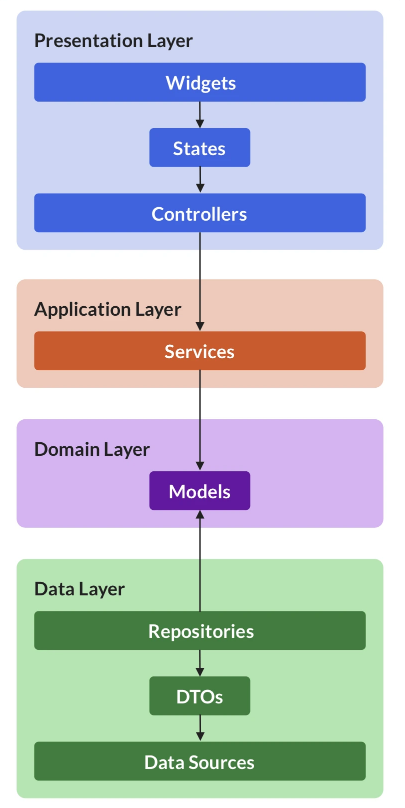
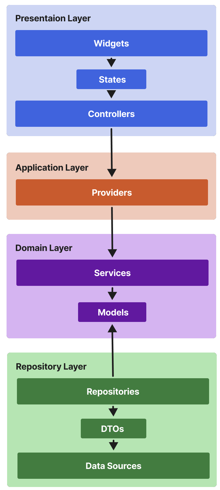

##[<< README.md](./README.md)

# 기존 문제상황
- DDD 스타일의 `clean architecture` 를 플러터에서도 적용하려고 하는데 효율적으로 되지 않음.
- 프로젝트의 구조를 위해서 만들었는데 오히려 개발 효율이 떨어지는 역효과가 나옴.
- `Riverpod` 를 사용하여 구현하고자 함.

# 변경 내용
[참고링크](https://codewithandrea.com/articles/flutter-app-architecture-riverpod-introduction/)


## Repository Layer (위 그림에서의 Data Layer)
- `data layer`라고 했을때 패키지 이름이 `data`라고 명명되어 혼돈이 생겨 `repository layer`라고 했음.
```dart
final clientProvider = Provider(
    (ref) => Dio(BaseOptions(baseUrl: 'http://$serverIP:8080/api/v1')));

final feedbackRepositoryProvider =
    Provider<FeedbackRepositoryAPI>((ref) => FeedbackRepositoryAPI(ref.read));
```
- `repository.dart` 에 `feedback`, `trainer` 등 여러 `repository`를 넣어두는 방식으로 사용.
- 각각의 `repository`는 개별 파일에서 구현하도록 함.
- `repository`의 구현 함수는 dto의  `response`를 매핑해여 `domain layer`에 전달함. 즉, `domain layer`에서는 도메인에 정의된 객체로 전달 받음.


##  Domain Layer
- 여기서의 `data` 객체의 종류는 두가지가 있는데 `entity`와 `command`가 있음.
- `entity` : java-spring에서 구현한것과 같은 실질적인 데이터 객체
- `command` : `api`통신을 할때 전달을 하기 위해 사용하는 객체. 이름을 `reigsterXXX`, `updateXXX` 이런 식으로 쓰면 될거같음(dart에서는 inner class가 없어서 이름을 잘 정해야 안헷갈릴거 같음)
- 이 두가지 종류의 객체를 사용해서 `service`가 구현됨.
``` dart
abstract class FeedbackService {
  Future<FitqaFeedback> getFeedbackDetail(String feedbackToken);
  Future<List<FitqaFeedback>> getFeedbackAll();
  Future<FitqaFeedback> registerFeedbackComment(
      String feedbackToken, RegisterFeedbackComment command);
}
```

## Application Layer
- 여기서의 역할은 `Domain layer`의 `service`를 사용해서 데이터를 받아오고, 그 데이터를 `State`로 감싸기.
- 그리고 이걸 `Riverpod`의 `Provider`로 만들어서 `Presentation Layer`로 전달.
- 92b946f : 최초 구현 내용
```dart
class FeedbackDetailNotifier extends StateNotifier<State<FitqaFeedback>> {
  FeedbackDetailNotifier(this.feedbackService, this.feedbackToken)
      : super(const State.init()) {
    getFeedbackDetail();
  }

  FeedbackService feedbackService;
  String feedbackToken;

  void getFeedbackDetail() async {
    try {
      state = const State.loading();
      final feedback = await feedbackService.getFeedbackDetail(feedbackToken);
      state = State.success(feedback);
    } on Exception catch (e) {
      state = State.error(e);
    }
  }

  void addComment(String comment) async {
    try {
      state = const State.loading();
      final feedback = await feedbackService.registerFeedbackComment(
          feedbackToken,
          RegisterFeedbackComment(writerId: "123", comment: comment));
      state = State.success(feedback);
    } on Exception catch (e) {
      state = State.error(e);
    }
  }
}
```
- `StateNotifier`를 구현해서 넣어주면 되는데 여기서 문제는 `Feedback`을 하나로 묶을수 있는게 아니라 `FeedbackList`, `FeedbackDetail`로 나눠서 만들었음. (이건 `StateNotifier`에서 한 종류의 객체만 리턴해줄 수 있기 때문)
- `StateNotifier` 내부에서 초기값은 `super(const State.init())`  이 부분에서 넣어줄 수 있는데 `State` 객체를 만들어뒀기 때문에 초기 객체를 안만들어줘도 됨.
```dart
final selectedFeedbackTokenProvider = StateProvider<String>((ref) => "");
```
- 이외에도 콜백지옥을 없애기 위해 필요한 `Provider`를 추가해도됨.
- 이렇게하면 `FedbackList`에서 `Feedback`을 선택했을때 `selectedFeedbackTokenProvider`만 변경해주고 디테을 화면을 보여주면 해당 내용이 나오도록 할 수 있음.

## Presentaion Layer
- 여기서는 당연하게도 `application layer`에서 만들어진 `provider`를 가져다가 쓰기만 하면 됨.
```dart
final feedbacks = ref.watch(feedbackListProvider);
final feedbackTokenController = ref.watch(selectedFeedbackTokenProvider.notifier);
```
- 뒤에 notifier를 붙이면 `StateNotifier`에서 구현한 함수들을 사용할 수 있는데 이건 변수명에 `Controller`를 붙이기로 함.
- 그냥 데이터를 읽어오는것만 하는애는 `provider`만 넣어주면 됨.
``` dart
feedbacks.maybeWhen(
              success: (feedbacks) => _buildFeedbackListView(
                  context, feedbacks, feedbackTokenController),
              error: (err) => Center(
                    child: Text(err.toString()),
                  ),
              orElse: () => const Expanded(
                    child: Center(
                      child: CircularProgressIndicator(),
                    ),
                  ))
```
- 이렇게해서 가져온 데이터는 `State` 객체로 묶여있기 때문에 각 상황에 대해서 처리해줘야 함.
- `maybeWhen`을 쓰면 모든 상황에 대해서 처리 안해줘도 되고, `when`을 사용하면 모든 상황에 대해 처리해줘야함.
- `init`, `loading`, `success`, `error`, `orElse` 5개의 상태가 있는데 왠만하면 `success`, `orElse`만 처리하고, 상위 `Widget`에서는 `error`, `loading`을 추가적으로 처리해주면 좋다고 생각함.
``` dart
final feedbackDetail = ref.watch(feedbackDetailProvider).data!;
```
- 만약에 하나의 `FeedbackDetail`을 만드는데 `Widget`을 여러개 만들어서 구현했을때, 모든 `Widget`에서 `maybeWhen`, `When` 으로 데이터를 처리하면 코드도 길어지고 로딩창도 여러개가 나오게 됨.
- 이를 해결하기 위해서 `FeedbackDetail` 상위 `Widget`에서는 `maybeWhen`으로 처리하고 그 하위 `Widget`에서는 그냥 위의 코드처럼 강제로 데이터를 가져오는건 어떨까 하고 생각함.
### 내부적인 `Controller` 사용
- `flutter`에서 `TextField`등의 값을 가져오기 위해서는 `statefulWidget`으로 만들고 `Controller`를 만들어서 가져오도록 되어있음.
- 이걸 `Riverpod` 의 `provider`로 값을 가져오도록 구현할 수 있음.
```dart
final _commentProvider = StateProvider<String>((ref) => "");

@override
  Widget build(BuildContext context, WidgetRef ref) {
    final commentContentController = ref.watch(_commentProvider.notifier);

    return Container(
      height: 50,
      child: Row(
          Expanded(
            child: TextField(
              onChanged: (value) => {commentContentController.state = value},
              decoration: const InputDecoration(
                  border: UnderlineInputBorder(), hintText: "댓글쓰기"),
            ),
          ),
          TextButton(
              onPressed: () {
                feedbackController.addComment(commentContentController.state);
              },
              child: Text("게시"))
      ),
    );
  }
```
- 이것도 마찬가지로 값을 쓰는 행위도 해야되기때문에 `Controller`라는 `postfix`를 변수명에 포함함.
- 이런 형태의 `Provider`는 `application layer`에 넣는게 아니라 `Widget` 내부에서만 사용하는건 어떨까 싶음.

## 결론
- 배운 DDD의 클린 아키텍처를 `flutter`에서도 구현하려고 했지만 그대로 구현하기에는 어려움이 있어서 변형된 버전으로 사용하기로 함.
- [참고링크](https://codewithandrea.com/articles/flutter-app-architecture-riverpod-introduction/) 에서 제시한 방법도 글쓴사람이 독자적인 구조를 만든거고, 그걸 설명했지만 아직 모든 내용을 설명하지 못한 상태임. (4월 26일 강의 게시한다고 함)

| 참고 링크의 구조          | 새로만든 구조 |
:-------------------------:|:-------------------------:
  |  

